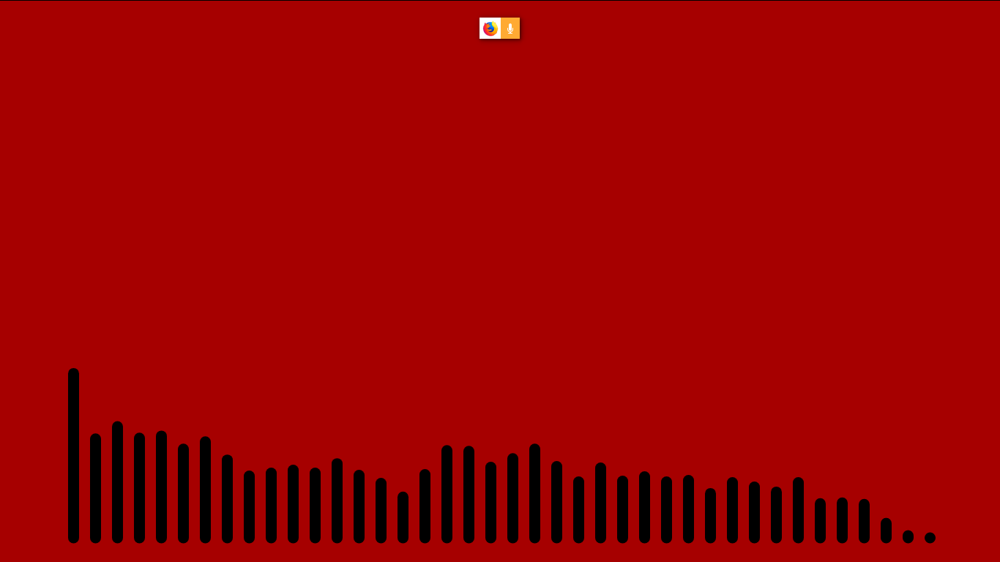

# MusicVisualisers

Music Visualisation is basically a way of expressing sound through computer graphics. These graphics are around us for more than two decades. But, I was specifically aiming to design a visualiser similar to what [Monstercat](https://www.monstercat.com/) uses in their [YouTube](https://www.youtube.com) videos, [this one](https://www.youtube.com/watch?v=4bDZvqQqyJ8) for example.

So I decided that I should try making something similar to this using little bit of [JavaScript](https://www.w3schools.com/jS/default.asp) magic. The [p5.js](https://p5js.org/) library which is the JavaScript version of [Processing](https://processing.org/) is quite fitting for the task as it is a drawing library and quite perfect for designing and implementing graphics inside a browser quickly.

Now these visualisers work on the principles of [FFT](https://en.wikipedia.org/wiki/Fast_Fourier_transform) better known as **Fast Fourier Transform**. Simply speaking, FFT is the process of breaking a signal into it's constituent frequencies. Think of it like this, when you play a guitar, the resultant sound is a mix of the sounds that would be individually produced by the chords and the amplitude of each of sounds will be amount of force with which you strike the chord/chords. So, each of the chords will release waves that consist of a standard frequency and an amplitude and when you apply FFT on a guitar sound, you will get the amplitudes of all these frequencies which make up the guitar sound. Still didn't get it? Don't worry I will leave a link in this document which will be helpful.

# Available Visualisers

* Linear Visualiser
* Circular Visualiser

# Linear Visualiser

This version provides a linear visualisation of the recorded FFT sepctrum.

